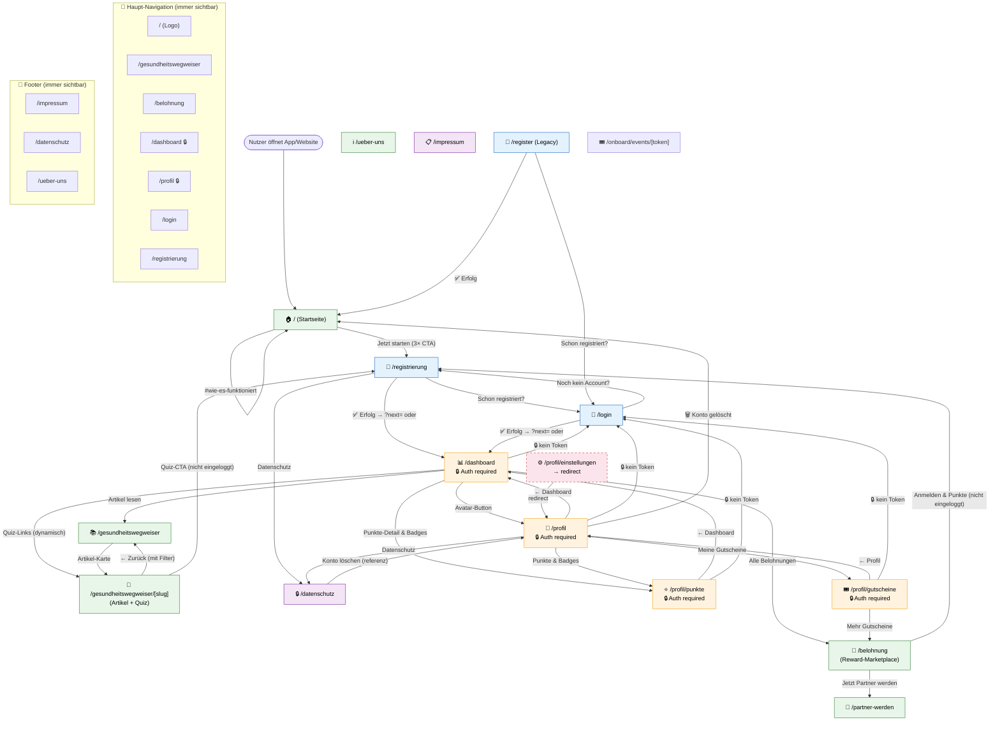

# AustroFit – Screen Flow

Stand: 2026-03-15

## Gesamtübersicht (Mermaid-Diagramm)

> In VS Code mit der Erweiterung "Markdown Preview Mermaid Support" (Ctrl+Shift+V) oder auf GitHub rendern lassen.



---

## Screen-Übersicht nach Bereich

### 🌐 Öffentliche Seiten (kein Login nötig)

| Screen | Route | Erreichbar über |
|--------|-------|-----------------|
| Startseite | `/` | Navbar (Logo), direkt |
| Gesundheitswegweiser | `/gesundheitswegweiser` | Navbar, Dashboard |
| Artikel-Detail + Quiz | `/gesundheitswegweiser/[slug]` | Artikel-Karte, Dashboard-Quiz-Link |
| Belohnungen | `/belohnung` | Navbar, Dashboard, Gutscheine |
| Partner werden | `/partner-werden` | Belohnungen-Seite |
| Über uns | `/ueber-uns` | Footer |
| Datenschutz | `/datenschutz` | Footer, Registrierung, Profil |
| Impressum | `/impressum` | Footer |

### 🔑 Auth-Seiten

| Screen | Route | Erreichbar über |
|--------|-------|-----------------|
| Login | `/login` | Navbar, Registrierung, Auth-Guard-Redirect |
| Registrierung | `/registrierung` | Navbar, Startseite, Login, Quiz-CTA, Belohnungen |
| Registrierung (Legacy) | `/register` | (nur direkt/alt) |

### 🔒 Geschützte Seiten (Login erforderlich)

| Screen | Route | Erreichbar über | Auth-Guard-Ziel |
|--------|-------|-----------------|-----------------|
| Dashboard | `/dashboard` | Navbar, nach Login/Register | `/login` |
| Profil (Einstellungen) | `/profil` | Navbar, Dashboard, `/profil/einstellungen` | `/login?next=/profil` |
| Punkte & Badges | `/profil/punkte` | Dashboard, Profil | `/login?next=/profil/punkte` |
| Meine Gutscheine | `/profil/gutscheine` | Profil | `/login?next=/profil/gutscheine` |
| Einstellungen (Redirect) | `/profil/einstellungen` | – | → `/profil` |

### 🎟️ Spezial-Routen

| Screen | Route | Beschreibung |
|--------|-------|--------------|
| Event-Onboarding | `/onboard/events/[token]` | Token-basierter Einstieg (Veranstaltungen) |

---

## Auth-Logik im Überblick

```
Kein Token vorhanden
       ↓
Auth-Guard schlägt an
       ↓
→ /login?next=<ursprüngliche-url>
       ↓
Login erfolgreich
       ↓
→ ?next= Param (oder /dashboard als Fallback)
```

```
Registrierung erfolgreich
       ↓
Auto-Login
       ↓
Init-Onboarding API (Willkommens-Punkte)
       ↓
→ ?next= Param (oder /dashboard als Fallback)
```

---

## Komponenten-Modals (kein eigener Screen)

| Komponente | Ort | Öffnet sich bei |
|------------|-----|-----------------|
| `GutscheinDetailModal` | `/profil/gutscheine` | Klick auf Gutschein-Karte |
| `EinloesungsModal` | `/belohnung` | "Einlösen"-Button auf Angebot-Karte |
| `GutscheinScreen` | innerhalb EinloesungsModal | Nach erfolgreichem Einlösen |
| `HealthPermissionPrompt` | Dashboard | Erste Sitzung ohne Health-Permission |
| `PWAInstallBanner` | Dashboard | Browser PWA-Install-Event verfügbar |
| `SyncToast` | Dashboard | Nach Schritt-Synchronisierung |

---

## API-Routen (kein eigener Screen, nur Datenfluss)

```
/api/auth/login          ← /login, /registrierung
/api/auth/register       ← /registrierung
/api/auth/init-onboarding ← /registrierung (nach Register)
/api/auth/refresh        ← automatisch

/api/me                  ← Dashboard, Login (Analytics)
/api/profile             ← /profil
/api/profile/delete      ← /profil (Konto löschen)

/api/ledger-total        ← Dashboard, /belohnung
/api/ledger-entries      ← /profil/punkte

/api/steps/sync          ← Dashboard (SchrittSyncButton)
/api/steps/manual        ← Dashboard (ManuelleSchrittEingabe)

/api/gutscheine          ← /profil/gutscheine
/api/redeem              ← /belohnung (EinloesungsModal)

/api/awin/programs       ← /belohnung
/api/awin/my-unlocks     ← /profil/gutscheine
/api/awin/webhook        ← extern (AWIN)

/api/badges-summary      ← Dashboard, /profil/punkte
/api/quizzes             ← Dashboard
/api/quiz-status         ← /gesundheitswegweiser
/api/quiz-attempts       ← /gesundheitswegweiser/[slug] (anon)
/api/claim               ← /registrierung, /login (nach anon Quiz)

/api/partner             ← /belohnung (lokale Partner)
```
